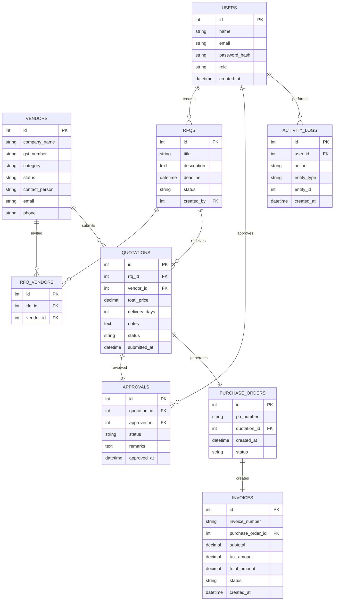
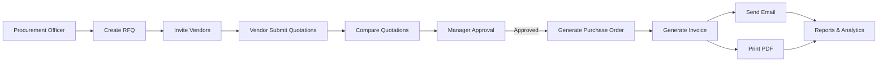

# vendor odoo hackathon

# Member 1 — Backend + Database + Business Logic

### Responsibilities

#### Authentication & Roles

* Login
* Signup
* JWT/Auth
* RBAC (Admin, Vendor, Manager, Procurement Officer)

#### Database Design

Create all entities:

```text
User
Vendor
RFQ
Quotation
Approval
PurchaseOrder
Invoice
ActivityLog
```

#### APIs

* Vendor CRUD
* RFQ CRUD
* Quotation Submission
* Approval APIs
* PO Generation
* Invoice Generation

#### Business Workflow

```text
RFQ
 ↓
Quotation
 ↓
Approval
 ↓
PO
 ↓
Invoice
```

This is the heart of the project.

#### PDF & Email

* Generate Invoice PDF
* Send invoice email

---

# Member 2 — Frontend + Dashboard + UX

### Responsibilities

#### UI Design

* Layout
* Sidebar
* Navbar
* Responsive pages

#### Screens

```text
Login
Dashboard
Vendor Management
RFQ Creation
Quotation Submission
Quotation Comparison
Approval Workflow
PO & Invoice
Reports
```

#### Dashboard

* Analytics cards
* Charts
* Statistics

#### Tables

* Search
* Filter
* Sorting
* Pagination

#### Role-based UI

Show different menus for:

* Admin
* Vendor
* Manager
* Procurement Officer

---

# Integration Points


---

# Base URL

```http
/api/v1
```

---

# 1. Authentication

## Login

```http
POST /auth/login
```

Request

```json
{
  "email": "admin@vendorbridge.com",
  "password": "password123"
}
```

Response

```json
{
  "token": "jwt_token",
  "user": {
    "id": 1,
    "name": "Admin",
    "role": "ADMIN"
  }
}
```

---

## Register

```http
POST /auth/register
```

```json
{
  "firstName": "John",
  "lastName": "Doe",
  "email": "john@gmail.com",
  "phone": "9876543210",
  "country": "India",
  "role": "PROCUREMENT_OFFICER",
  "password": "password123"
}
```

---

## Current User

```http
GET /auth/me
```

---

# 2. Dashboard

Matches Screen 3

## Dashboard Summary

```http
GET /dashboard
```

Response

```json
{
  "activeRfqs": 12,
  "pendingApprovals": 5,
  "monthlySpend": 230000,
  "overdueInvoices": 3,
  "recentPurchaseOrders": []
}
```

---

# 3. Vendor Module

Matches Screen 4

## Get Vendors

```http
GET /vendors
```

Filters

```http
GET /vendors?status=ACTIVE
GET /vendors?search=infra
```

Response

```json
[
  {
    "id": 1,
    "name": "Infra Supplies",
    "gstNumber": "24ABCDE1234",
    "category": "Construction",
    "status": "ACTIVE"
  }
]
```

---

## Vendor Details

```http
GET /vendors/{id}
```

---

## Create Vendor

```http
POST /vendors
```

---

## Update Vendor

```http
PUT /vendors/{id}
```

---

## Block Vendor

```http
PATCH /vendors/{id}/status
```

```json
{
  "status": "BLOCKED"
}
```

---

# 4. RFQ Module

Matches Screen 5

---

## Create RFQ

```http
POST /rfqs
```

```json
{
  "title": "Office Furniture Q2",
  "category": "Furniture",
  "description": "Chairs and desks",
  "deadline": "2025-06-15",
  "vendors": [1,2,3],
  "items": [
    {
      "itemName": "Chair",
      "quantity": 25,
      "unit": "NOS"
    }
  ]
}
```

---

## Get RFQs

```http
GET /rfqs
```

---

## RFQ Details

```http
GET /rfqs/{id}
```

Response

```json
{
  "id": 1,
  "title": "Office Furniture",
  "vendors": [],
  "items": []
}
```

---

## Publish RFQ

```http
POST /rfqs/{id}/publish
```

---

## Draft RFQ

```http
POST /rfqs/{id}/draft
```

---

# 5. Quotation Module

Matches Screen 6

---

## Get RFQs Available To Vendor

```http
GET /vendor/rfqs
```

---

## Submit Quotation

```http
POST /quotations
```

```json
{
  "rfqId": 1,
  "items": [
    {
      "itemId": 1,
      "unitPrice": 3500,
      "deliveryDays": 7
    }
  ],
  "gstPercentage": 18,
  "notes": "Payment within 30 days"
}
```

---

## My Quotations

```http
GET /vendor/quotations
```

---

## Quotation Details

```http
GET /quotations/{id}
```

---

# 6. Quotation Comparison

Matches Screen 7

---

## Compare Quotations

```http
GET /rfqs/{id}/comparison
```

Response

```json
{
  "rfqId": 1,
  "quotations": [
    {
      "quotationId": 1,
      "vendor": "Infra Supplies",
      "amount": 185000,
      "deliveryDays": 10,
      "rating": 4.5
    }
  ]
}
```

---

## Select Winning Quotation

```http
POST /rfqs/{id}/select-quotation
```

```json
{
  "quotationId": 1
}
```

---

# 7. Approval Workflow

Matches Screen 8

---

## Approval Queue

```http
GET /approvals/pending
```

---

## Approval Details

```http
GET /approvals/{id}
```

---

## Approve

```http
POST /approvals/{id}/approve
```

```json
{
  "remarks": "Looks good"
}
```

---

## Reject

```http
POST /approvals/{id}/reject
```

```json
{
  "remarks": "Price too high"
}
```

---

# 8. Purchase Orders

---

## Generate PO

```http
POST /purchase-orders
```

```json
{
  "quotationId": 1
}
```

---

## Get Purchase Orders

```http
GET /purchase-orders
```

---

## Purchase Order Details

```http
GET /purchase-orders/{id}
```

---

# 9. Invoice Module

Matches Screen 9

---

## Generate Invoice

```http
POST /invoices
```

```json
{
  "purchaseOrderId": 1
}
```

---

## Invoice Details

```http
GET /invoices/{id}
```

---

## List Invoices

```http
GET /invoices
```

---

## Mark Invoice Paid

```http
PATCH /invoices/{id}/mark-paid
```

---

## Download PDF

```http
GET /invoices/{id}/pdf
```

Returns PDF.

---

## Email Invoice

```http
POST /invoices/{id}/email
```

---

# 10. Activity Logs

Matches Screen 10

---

## Activity Feed

```http
GET /activities
```

Filters

```http
GET /activities?type=RFQ
GET /activities?type=APPROVAL
```

Response

```json
[
  {
    "id": 1,
    "action": "RFQ Published",
    "timestamp": "2025-05-22T10:30:00"
  }
]
```

---

# 11. Reports

Matches Screen 11

---

## Procurement Analytics

```http
GET /reports/summary
```

Response

```json
{
  "totalSpend": 1240000,
  "activeVendors": 28,
  "poFulfillment": 94,
  "overdueInvoices": 3
}
```

---

## Vendor Analytics

```http
GET /reports/vendors
```

---

## Monthly Trend

```http
GET /reports/monthly-trend
```

---

## Export Report

```http
GET /reports/export?format=pdf
```

or

```http
GET /reports/export?format=excel
```

---

# Minimum Tables Needed

```text
users
vendors

rfqs
rfq_items
rfq_vendors

quotations
quotation_items

approvals

purchase_orders
purchase_order_items

invoices
invoice_items

activity_logs
```


## Database Relationship Diagram




---

## Workflow Diagram (Also GitHub Compatible)





---

## Simplified Domain Model

This is the mental model judges will care about:

```text
User
 │
 ├── Creates RFQ
 │
RFQ
 │
 ├── Assigned to Vendors
 │
 └── Receives Quotations
          │
          ▼
      Quotation
          │
          ▼
      Approval
          │
          ▼
   Purchase Order
          │
          ▼
       Invoice
```

### Division

**Member 1**

* Users
* RFQs
* Quotations
* Approvals
* Database

**Member 2**

* Vendors
* Purchase Orders
* Invoices
* Dashboard
* Reports/UI

